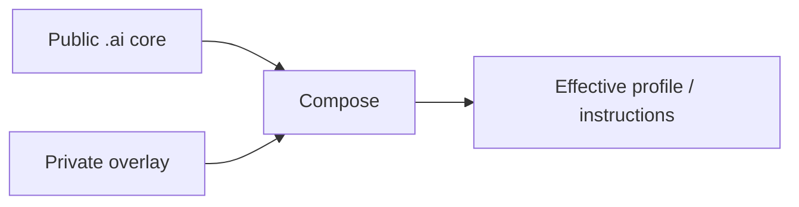

<div align="center">

# `.ai`

**Portable AI core for profiles, overlays, provider adapters, reusable instructions and skills.**

[](https://github.com/trvny/.ai/actions/workflows/validate.yml)
[](https://spdx.org/licenses/ISC)
<a href="https://deepwiki.com/trvny/.ai"></a>

[**Submodule guide**](docs/submodule.md) · [**Example overlay**](examples/profile.overlay.yaml) · [**Schema**](schema/style-profile.schema.json)

</div>

---

## Public core, private overlay

`.ai` keeps reusable AI configuration in one public place while downstream repositories keep their own private or project-specific differences.



Later layers win. Reusable changes go upstream; local differences stay downstream. No reverse synchronization is needed.

## Layout

```text
.ai/
├── AGENTS.md      canonical repository guidance
├── CLAUDE.md      Claude import shim -> AGENTS.md
├── GEMINI.md      Gemini import shim -> AGENTS.md
├── profiles/      base profiles
├── examples/      overlay examples
├── schema/        profile schema
├── tools/         composition helpers
├── tests/         core and repository contract tests
├── instructions/  reusable instructions
├── styles/        style guidance
├── templates/     project starters
├── skills/        portable opt-in skills
├── .claude/       Claude reference defaults
└── .codex/        Codex reference defaults
```

`CLAUDE.md` and `GEMINI.md` are regular text import shims rather than symlinks, so the canonical `AGENTS.md` also works in Windows checkouts without requiring symlink support.

Files here are building blocks. Providers do not automatically discover or apply everything in the repository.

## Use it in another repository

The usual setup is a pinned submodule plus a local overlay:

```bash
git submodule add https://github.com/trvny/.ai.git .ai/core
cp .ai/core/examples/profile.overlay.yaml .ai/profile.yaml
```

For repositories that already use it:

```bash
git submodule update --init --recursive
```

See **[docs/submodule.md](docs/submodule.md)** for cloning, profile composition, rendering, updates and CI checkout.

## Composition

```bash
python .ai/core/tools/merge_profile.py \
  .ai/core/profiles/default.yaml \
  .ai/profile.yaml \
  --schema .ai/core/schema/style-profile.schema.json \
  --output .ai/generated/profile.yaml
```

The final composed profile is validated against the schema. Partial overlays only need to contain the values they change.

Provider-specific files remain reference defaults. Adapt or expose them where the consuming tool expects them rather than duplicating the whole core.

## Security boundary

Keep credentials, tokens, personal paths, private endpoints and machine-specific configuration out of the public core. Use environment variables, secret storage or ignored local files instead.

## Design rules

- one maintained source of truth per concern
- public core, downstream overlays
- thin provider adapters
- generated output separate from maintained input
- simple files before frameworks
- explicit behavior before hidden magic

## License

[ISC](LICENSE)

---

## 📰 Mininews

<!--README_FEED:START-->
- [Oto "genetyczny ChatGPT". Tak wygląda potężna broń naukowców](https://antyweb.pl/genetyczny-chatgpt)
- [Nowy Park Wodny niedaleko Krakowa! Już gotowy, otwarcie we wrześniu. Basen w Krzeszowicach czeka jeszcze na cennik - Dziennik Polski](https://news.google.com/atom/articles/CBMi7AFBVV95cUxNSHZ3aldwaXJYUHJIekxWem1WaEhBaEdfbm8waUFrdU1tanhwVmNuMGkyME53NlNyNzRRbXk1MWlzT0dqam9maExBV1NnbEJ0MHNIX2NKUzdUejlObEI1ZFNyYVUzWkU4UDZGd21la3c0VGxDeF9Yd1VZV3NPVnNRVm8tYTRlX0duNkVUd2loUHZEaVZoN0NrWkJVSFp5TnFqTXJsTnF4X1RBYVg1dHVMVmZrbU52alNHT2p3Mk9Na3pCREYwS01GWG1OUFBLUjVNbm5WOGxtMzQzRDVLRUZDVUo3c0lzTWhoWkN2Ng?oc=5)
- [Procesory Apple M5 Ultra i M6 biją nowe rekordy. Brak im konkurencji](https://antyweb.pl/procesory-apple-m5-ultra-i-m6-bija-nowe-rekordy-brak-im-konkurencji)
- [9-latek wydał 446 tysięcy złotych na reklamy swoich filmików. Policzyłem, co za te pieniądze dostał](https://promptowy.com/9-latek-118-tysiecy-dolarow-reklamy-youtube/)
- [Kolejowa inwestycja za 147 mln zł w Jaworznie. Projekt wrócił do procedowania - jaw.pl](https://news.google.com/atom/articles/CBMiZEFVX3lxTE01elNJOWxVbWprdjNNbkxJR0VLRkdlREZvV2FiODQwSS0zU3hQMGxkT291M0dMc0RhSjZMcjVNU3BGNXJXcGNrZGhqMFdxazR5cl9qdXZNWGRQMDRJcEhEelZIWU0?oc=5)
- [Degradation with Gemini 3.8 Flash](https://www.githubstatus.com/incidents/nlxnbqnkdzdl)
<!--README_FEED:END-->

## 💬 Cytat z szuflady

<!-- markdownlint-disable MD033 -->
<!--STARTS_HERE_QUOTE_README-->
<i>❝HDMI charges its licensed manufacturers $10,000 per year plus $0.15 per cable, reduced to $0.05 if the HDMI logo is on the socket.❞</i>
<!--ENDS_HERE_QUOTE_README-->
<!-- markdownlint-enable MD033 -->
