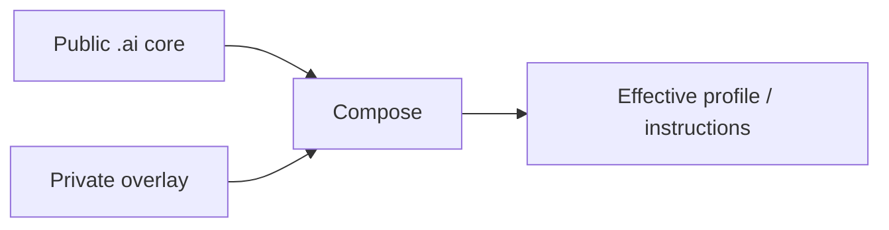

<div align="center">

# `.ai`

**Portable AI core for profiles, overlays, provider adapters, reusable instructions and skills.**

[](https://github.com/trvny/.ai/actions/workflows/validate.yml)
[](https://spdx.org/licenses/ISC)
<a href="https://deepwiki.com/trvny/.ai"></a>

[**Submodule guide**](docs/submodule.md) · [**Example overlay**](examples/profile.overlay.yaml) · [**Schema**](schema/style-profile.schema.json)

</div>

---

## Public core, private overlay

`.ai` keeps reusable AI configuration in one public place while downstream repositories keep their own private or project-specific differences.



Later layers win. Reusable changes go upstream; local differences stay downstream. No reverse synchronization is needed.

## Layout

```text
.ai/
├── AGENTS.md      canonical repository guidance
├── CLAUDE.md      Claude import shim -> AGENTS.md
├── GEMINI.md      Gemini import shim -> AGENTS.md
├── profiles/      base profiles
├── examples/      overlay examples
├── schema/        profile schema
├── tools/         composition helpers
├── tests/         core and repository contract tests
├── instructions/  reusable instructions
├── styles/        style guidance
├── templates/     project starters
├── skills/        portable opt-in skills
├── .claude/       Claude reference defaults
└── .codex/        Codex reference defaults
```

`CLAUDE.md` and `GEMINI.md` are regular text import shims rather than symlinks, so the canonical `AGENTS.md` also works in Windows checkouts without requiring symlink support.

Files here are building blocks. Providers do not automatically discover or apply everything in the repository.

## Use it in another repository

The usual setup is a pinned submodule plus a local overlay:

```bash
git submodule add https://github.com/trvny/.ai.git .ai/core
cp .ai/core/examples/profile.overlay.yaml .ai/profile.yaml
```

For repositories that already use it:

```bash
git submodule update --init --recursive
```

See **[docs/submodule.md](docs/submodule.md)** for cloning, profile composition, rendering, updates and CI checkout.

## Composition

```bash
python .ai/core/tools/merge_profile.py \
  .ai/core/profiles/default.yaml \
  .ai/profile.yaml \
  --schema .ai/core/schema/style-profile.schema.json \
  --output .ai/generated/profile.yaml
```

The final composed profile is validated against the schema. Partial overlays only need to contain the values they change.

Provider-specific files remain reference defaults. Adapt or expose them where the consuming tool expects them rather than duplicating the whole core.

## Security boundary

Keep credentials, tokens, personal paths, private endpoints and machine-specific configuration out of the public core. Use environment variables, secret storage or ignored local files instead.

## Design rules

- one maintained source of truth per concern
- public core, downstream overlays
- thin provider adapters
- generated output separate from maintained input
- simple files before frameworks
- explicit behavior before hidden magic

## License

[ISC](LICENSE)

---

## 📰 Mininews

<!--README_FEED:START-->
- [How to Engage with New Media: A Strategic Guide for Nonprofit Organizations](https://carnegieendowment.org/research/2026/08/how-to-engage-with-new-media-a-strategic-guide-for-nonprofit-organizations)
- [How the U.S. Export-Import Bank Can Finally Join the Fight Against Climate Change](https://carnegieendowment.org/research/2026/09/renewable-energy-investment-united-states-exim-export-import-bank)
- [Far-right triumph in eastern Germany leaves migrants questioning their future](https://www.reuters.com/world/far-right-triumph-eastern-germany-leaves-migrants-questioning-their-future-2026-09-07/)
- [Nocny dramat przy Kościuszki. 42-latek pobity, zatrzymano trzy osoby - Przelom.pl - portal ziemi chrzanowskiej](https://news.google.com/atom/articles/CBMitAFBVV95cUxQc0FyTnY2T3YyZWN1ZjlYTXFNT0lJbFpuQWp4VTlPT1dEam53YlYzTmdJbUZ6a2F3QmVzbU1rUy1iZ0JIem85T2lUUm1aRFpPYkJ6MFFfOEdMbXpIdHdNbGNWZ2V1eVhIRThBU2ZpX09tQTNrbFhRci13LXM5SlpHeWE4TWxHSjVlV3hyUjlqanFERmRSS1hIZHl4QVU5clZhcDMyWWlhMmJ5Yjg0UmdlSjhBYlY?oc=5)
- [Paris investigates claim women were hidden from Hindu delegation at Eiffel Tower](https://www.reuters.com/business/media-telecom/paris-investigates-claim-women-were-hidden-hindu-delegation-eiffel-tower-2026-09-07/)
- [Nowa siedziba Nadleśnictwa Chrzanów. Powstanie okazały budynek - Przelom.pl - portal ziemi chrzanowskiej](https://news.google.com/atom/articles/CBMiuAFBVV95cUxPUHRNREYtdE5KOUJIdW1uRWhqZU1XU24xTkxLQjVGLVhwbFlXaEN2SmMwSjNBMjExT2tpUkRueC1FRUpLV1lUVHlCcHdDVWNKdTNDcHItWlZnQ251WERSOEN5MGthTW5iYmVvYVlzdm9qVC1uaF9mMmdIYU81dk94S0E2V0hKY1RuMGxiSDl2QWdmcW9RUDhYbXlReFl6TUwxVEJBZnJsUHNBb0VXcE5WbHAxNzlOcW96?oc=5)
<!--README_FEED:END-->

## 💬 Cytat z szuflady

<!-- markdownlint-disable MD033 -->
<!--STARTS_HERE_QUOTE_README-->
<i>❝IBM 5120 from 1980 was the heaviest desktop computer ever made. It weighed about 105 pounds, not including the 130 pounds external floppy drive.❞</i>
<!--ENDS_HERE_QUOTE_README-->
<!-- markdownlint-enable MD033 -->
