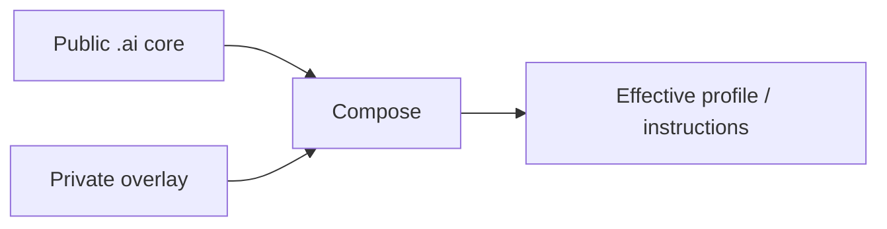

<div align="center">

# `.ai`

**Portable AI core for profiles, overlays, provider adapters, reusable instructions and skills.**

[](https://github.com/trvny/.ai/actions/workflows/validate.yml)
[](https://spdx.org/licenses/ISC)
<a href="https://deepwiki.com/trvny/.ai"></a>

[**Submodule guide**](docs/submodule.md) · [**Example overlay**](examples/profile.overlay.yaml) · [**Schema**](schema/style-profile.schema.json)

</div>

---

## Public core, private overlay

`.ai` keeps reusable AI configuration in one public place while downstream repositories keep their own private or project-specific differences.



Later layers win. Reusable changes go upstream; local differences stay downstream. No reverse synchronization is needed.

## Layout

```text
.ai/
├── AGENTS.md      canonical repository guidance
├── CLAUDE.md      Claude import shim -> AGENTS.md
├── GEMINI.md      Gemini import shim -> AGENTS.md
├── profiles/      base profiles
├── examples/      overlay examples
├── schema/        profile schema
├── tools/         composition helpers
├── tests/         core and repository contract tests
├── instructions/  reusable instructions
├── styles/        style guidance
├── templates/     project starters
├── skills/        portable opt-in skills
├── .claude/       Claude reference defaults
└── .codex/        Codex reference defaults
```

`CLAUDE.md` and `GEMINI.md` are regular text import shims rather than symlinks, so the canonical `AGENTS.md` also works in Windows checkouts without requiring symlink support.

Files here are building blocks. Providers do not automatically discover or apply everything in the repository.

## Use it in another repository

The usual setup is a pinned submodule plus a local overlay:

```bash
git submodule add https://github.com/trvny/.ai.git .ai/core
cp .ai/core/examples/profile.overlay.yaml .ai/profile.yaml
```

For repositories that already use it:

```bash
git submodule update --init --recursive
```

See **[docs/submodule.md](docs/submodule.md)** for cloning, profile composition, rendering, updates and CI checkout.

## Composition

```bash
python .ai/core/tools/merge_profile.py \
  .ai/core/profiles/default.yaml \
  .ai/profile.yaml \
  --schema .ai/core/schema/style-profile.schema.json \
  --output .ai/generated/profile.yaml
```

The final composed profile is validated against the schema. Partial overlays only need to contain the values they change.

Provider-specific files remain reference defaults. Adapt or expose them where the consuming tool expects them rather than duplicating the whole core.

## Security boundary

Keep credentials, tokens, personal paths, private endpoints and machine-specific configuration out of the public core. Use environment variables, secret storage or ignored local files instead.

## Design rules

- one maintained source of truth per concern
- public core, downstream overlays
- thin provider adapters
- generated output separate from maintained input
- simple files before frameworks
- explicit behavior before hidden magic

## License

[ISC](LICENSE)

---

## 📰 Mininews

<!--README_FEED:START-->
- [Episode 2: Financing War in the Grey Zone](https://www.rusi.org/podcasts/suspicious-transaction-report/episode-2-financing-war-grey-zone)
- [Rozkochów zachwycił jury. Jest wysokie miejsce i nagroda - Przelom.pl - portal ziemi chrzanowskiej](https://news.google.com/atom/articles/CBMipAFBVV95cUxPY0tiLU1SOHViRk1TcWtxZXltVWoyVlJYTmJ0NW1wa0ppN1p6cnlWOEE1NWtzYjRyYXRhN29KbmJKLW5pcHp6emJMTkJIVmJzd1d0d2duVEdHU0JuMXR6aEJ1bWFMeTJhSWd2QUE3Z3ZHSko2d2pRZ0tPRVF3aDdQczc1Z2Fiek9kVjhWbldTODJ3NlJUUGFFVkNTSFU5S0JiY1FSTQ?oc=5)
- [Recenzja Trails in the Sky 2nd Chapter. Must play dla fanów dobrych jRPG](https://antyweb.pl/recenzja-trails-in-the-sky-2nd-chapter-must-play-dla-fanow-dobrych-jrpg)
- [Ostrzeżenie pierwszego stopnia dla Chrzanowa i okolic. Uwaga na gestą mgłę - Przelom.pl - portal ziemi chrzanowskiej](https://news.google.com/atom/articles/CBMivAFBVV95cUxOZmdOeF9uQS13NWZsLUoxN1k2QWVSQWtJUkFKU3FtMEF0YjVWbnJqTjVqbnladUhfcWkwNFFjSG5nWHVDbGhkUmdHNzk1emx1QWstR0VJYUdUMGotTlVlOXZob2JmZ1ZteHN3Z3JxRWNqb2FtWmRYME81UXNhWXFBc1FWVERMSXN2MHRTY3N2cWdKY3k5UUItc19mTG84Zi1WaGEyNU1UNDRTUlFPWUpKa3RtbTRoWFZvT2VaOQ?oc=5)
- [PLLuM: polski model językowy państwa. Co to jest, gdzie działa i czym różni się od Bielika](https://promptowy.com/pllum/)
- [Jensen Huang: kim jest szef Nvidii, ile jest wart i jak zbudował najcenniejszą firmę świata](https://promptowy.com/jensen-huang/)
<!--README_FEED:END-->

## 💬 Cytat z szuflady

<!-- markdownlint-disable MD033 -->
<!--STARTS_HERE_QUOTE_README-->
<i>❝The first word spoken on the internet was “lo”. It was supposed to be “login” but the computer crashed after the first two letters.❞</i>
<!--ENDS_HERE_QUOTE_README-->
<!-- markdownlint-enable MD033 -->
