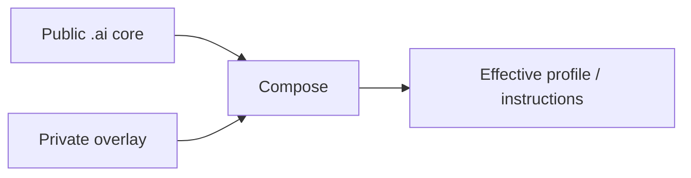

<div align="center">

# `.ai`

**Portable AI core for profiles, overlays, provider adapters, reusable instructions and skills.**

[](https://github.com/trvny/.ai/actions/workflows/validate.yml)
[](LICENSE)
<a href="https://deepwiki.com/trvny/.ai"></a>

[**Submodule guide**](docs/submodule.md) · [**Example overlay**](examples/profile.overlay.yaml) · [**Schema**](schema/style-profile.schema.json)

</div>

---

## Public core, private overlay

`.ai` keeps reusable AI configuration in one public place while downstream repositories keep their own private or project-specific differences.



Later layers win. Reusable changes go upstream; local differences stay downstream. No reverse synchronization is needed.

## Layout

```text
.ai/
├── AGENTS.md      canonical repository guidance
├── CLAUDE.md      Claude import shim -> AGENTS.md
├── GEMINI.md      Gemini import shim -> AGENTS.md
├── profiles/      base profiles
├── examples/      overlay examples
├── schema/        profile schema
├── tools/         composition helpers
├── tests/         core and repository contract tests
├── instructions/  reusable instructions
├── styles/        style guidance
├── templates/     project starters
├── skills/        portable opt-in skills
├── .claude/       Claude reference defaults
└── .codex/        Codex reference defaults
```

`CLAUDE.md` and `GEMINI.md` are regular text import shims rather than symlinks, so the canonical `AGENTS.md` also works in Windows checkouts without requiring symlink support.

Files here are building blocks. Providers do not automatically discover or apply everything in the repository.

## Use it in another repository

The usual setup is a pinned submodule plus a local overlay:

```bash
git submodule add https://github.com/trvny/.ai.git .ai/core
cp .ai/core/examples/profile.overlay.yaml .ai/profile.yaml
```

For repositories that already use it:

```bash
git submodule update --init --recursive
```

See **[docs/submodule.md](docs/submodule.md)** for cloning, profile composition, rendering, updates and CI checkout.

## Composition

```bash
python .ai/core/tools/merge_profile.py \
  .ai/core/profiles/default.yaml \
  .ai/profile.yaml \
  --schema .ai/core/schema/style-profile.schema.json \
  --output .ai/generated/profile.yaml
```

The final composed profile is validated against the schema. Partial overlays only need to contain the values they change.

Provider-specific files remain reference defaults. Adapt or expose them where the consuming tool expects them rather than duplicating the whole core.

## Security boundary

Keep credentials, tokens, personal paths, private endpoints and machine-specific configuration out of the public core. Use environment variables, secret storage or ignored local files instead.

## Design rules

- one maintained source of truth per concern
- public core, downstream overlays
- thin provider adapters
- generated output separate from maintained input
- simple files before frameworks
- explicit behavior before hidden magic

## License

[ISC](LICENSE). Use, fork and reshape it while keeping the copyright and license notice.

---

## 📰 Mininews

<!--README_FEED:START-->
- [Confronting the Barriers to AI Diffusion in the U.S. Military](https://carnegieendowment.org/research/2026/08/confronting-the-barriers-to-ai-diffusion-in-the-us-military)
- [US judges allow Trump to end protections for migrants from South Sudan, Myanmar](https://news.google.com/rss/articles/CBMisAFBVV95cUxOS0R4Q05HNGkyM2Zzaml1b0lTTDJBeFpJWUx6YXZIOVM2RmJ1b0Nidk1qamJmQ2oyUFVVWW0wNWVCV0ZGRkx0c2gzdkh2c2F1TEZPR0lHRlUyNFJHdVhQYm1Ja2gwVjVCTkY5b2hHbWFtbFlBTlZDUTVFRDFERGEwSXhac3dXTHpRbFRxb1NYWHd6VWV6Qjl5bjFlZXVrMkZKOTdJWEZzcTRNSThsdEt1Vw?oc=5)
- [Spain's government announces immediate border controls with Italy in migration spat](https://news.google.com/rss/articles/CBMixwFBVV95cUxPTTcwY21xTGlrcmc5ZmE2cmRUMFpvSExKMTRoZWVubE9PbWpEbGl2dEo1U1BLNDViRDdpbVRmUUhvQmpzUWU4S3k4RnpfeFp0YVFQanRveFJpdkhtcUdlZFVGSTQ1bU5zRWNiQXdWX2ZILW5GeVMtRUJxbFQxTzR0dEN2VEYwandzR3BZb0MyZ0VjNVBXejlBU2UxUHg3YzNsNGdIbzVMaWd1UllZZDlGR2R1RkduWUNPdE9yNGFmVW5Ca19OQmlR?oc=5)
- [US official: We expect a deal soon between Iran and Oman on Strait of Hormuz](https://news.google.com/rss/articles/CBMiuAFBVV95cUxPMkZHc1FWRXNSWG5BdjNhZ0dqOEdNUFUtUl80NTNFYkFrM2RrLVBiSXlOOFdaek5hcEhIMl84OVJLZnVDMzNodFBScmliaFdNYUpaN21uQ3V3VmQ2V1p3MGZ0QUozdTJQb09EcTJ1VERWc3E0d1Z5dkNvalFEcEVSQzRQejkwZmdybVJTVDJPbk4wMS1hWFBOaXJKaTE4MUxHNS1STUFxTzN4S0ZDSmtZOXFhdUZaa0d1?oc=5)
- [EXCLUSIVE: Trump administration to back three mineral projects with $58 million in financing](https://news.google.com/rss/articles/CBMiuwFBVV95cUxPdVZodXZtRWQ1dzdvLWxpTi1jTFNKUlF4RnYxc2JSTnZDdXE3S0gtQ1R5MENuMFlUU1M2S1pMX3pMVFBqZGh6NjhlOUNybmd3MU5WR2RVOG91Wml5WGFNS0w1OVhSWDFiWmJsRzBoRzlJZHNnUG5LeEN3M3RaNW9mNkVvMkYzazRRZF85ek5aYk5kOExBNERwTlN5dGNVdjl4MnZGRXRCZnB0NGNJaHRVWERQU2gzd3pqRVpr?oc=5)
- [Przegląd AI: 7 sierpnia 2026](https://promptowy.com/przeglad-ai-2026-08-07/)
<!--README_FEED:END-->

## 💬 Cytat z szuflady

<!-- markdownlint-disable MD033 -->
<!--STARTS_HERE_QUOTE_README-->
<i>❝Conquer anger with non-anger. Conquer badness with goodness. Conquer meanness with generosity. Conquer dishonesty with truth. — Buddha❞</i>
<!--ENDS_HERE_QUOTE_README-->
<!-- markdownlint-enable MD033 -->
