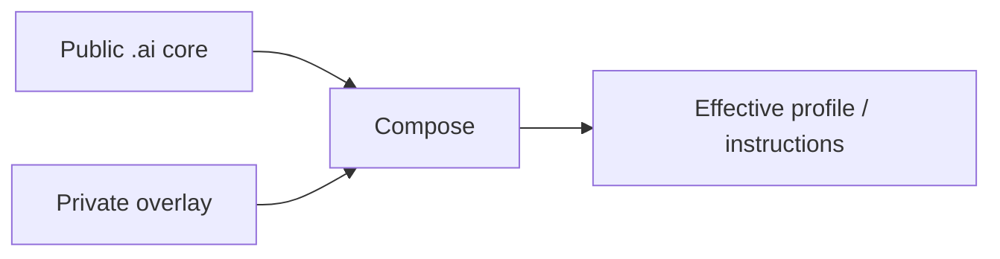

<div align="center">

# `.ai`

**Portable AI core for profiles, overlays, provider adapters, reusable instructions and skills.**

[](https://github.com/trvny/.ai/actions/workflows/validate.yml)
[](LICENSE)
<a href="https://deepwiki.com/trvny/.ai"></a>

[**Submodule guide**](docs/submodule.md) · [**Example overlay**](examples/profile.overlay.yaml) · [**Schema**](schema/style-profile.schema.json) · [**Token World Cup**](docs/token-worldcup.html)

</div>

---

## Public core, private overlay

`.ai` keeps reusable AI configuration in one public place while downstream repositories keep their own private or project-specific differences.



Later layers win. Reusable changes go upstream; local differences stay downstream. No reverse synchronization is needed.

## Layout

```text
.ai/
├── AGENTS.md      canonical repository guidance
├── CLAUDE.md      Claude import shim -> AGENTS.md
├── GEMINI.md      Gemini import shim -> AGENTS.md
├── profiles/      base profiles
├── examples/      overlay examples
├── schema/        profile schema
├── tools/         composition helpers
├── tests/         core and repository contract tests
├── instructions/  reusable instructions
├── styles/        style guidance
├── templates/     project starters
├── skills/        portable opt-in skills
├── .claude/       Claude reference defaults
└── .codex/        Codex reference defaults
```

`CLAUDE.md` and `GEMINI.md` are regular text import shims rather than symlinks, so the canonical `AGENTS.md` also works in Windows checkouts without requiring symlink support.

Files here are building blocks. Providers do not automatically discover or apply everything in the repository.

## Use it in another repository

The usual setup is a pinned submodule plus a local overlay:

```bash
git submodule add https://github.com/trvny/.ai.git .ai/core
cp .ai/core/examples/profile.overlay.yaml .ai/profile.yaml
```

For repositories that already use it:

```bash
git submodule update --init --recursive
```

See **[docs/submodule.md](docs/submodule.md)** for cloning, profile composition, rendering, updates and CI checkout.

## Composition

```bash
python .ai/core/tools/merge_profile.py \
  .ai/core/profiles/default.yaml \
  .ai/profile.yaml \
  --schema .ai/core/schema/style-profile.schema.json \
  --output .ai/generated/profile.yaml
```

The final composed profile is validated against the schema. Partial overlays only need to contain the values they change.

Provider-specific files remain reference defaults. Adapt or expose them where the consuming tool expects them rather than duplicating the whole core.

## Security boundary

Keep credentials, tokens, personal paths, private endpoints and machine-specific configuration out of the public core. Use environment variables, secret storage or ignored local files instead.

## Design rules

- one maintained source of truth per concern
- public core, downstream overlays
- thin provider adapters
- generated output separate from maintained input
- simple files before frameworks
- explicit behavior before hidden magic

## License

[ISC](LICENSE)

---

## 📰 Mininews

<!--README_FEED:START-->
- [Krzeszowice zyskają nowe miejsce dla młodych. Budowa trwa - krzeszowiceone.pl](https://news.google.com/atom/articles/CBMiqgFBVV95cUxPQUd0U1huc1J2bThOZzcySHUzSVdlUEZCZ29jV1ZfYURLZWNTeDZ3YmtMRy0wZ2pKTllUR1lmUktRekIxNG5mMmY5QWNIR3otWjJ0ajNIN0NMT2ZaN2JqM0VvcVBYVXpxeXpCczR3R2txU0ZTTXoxRFozZGdpT2NhVEJ2aWZ6cWlHZDJ3WEo0dEJHMXM5TWJSTnBtWTNLd0NfWTA1aEtlLXJDQdIBrwFBVV95cUxNTHJKUEMzRmJfNW0xOUIxWlhCc28wbTJ4QkpLdWtaRlF0X1JUaFdoOEg4Ylg5VkwzRzctZXNLaDN2VUgyTkdSSGhjSzJXTld2cFZyS1hoaUNQRm0zODhFQThYQ1Fwb3pKYW8xVGdJUWxNR296THBoX2JuQkFtdnptQ1ZVdVR2YTJhQ09NdDgzMUZrNnZOb1dFMERzNHBFQUUwRGVjbktoM29ta1R0U2dj?oc=5)
- [Święto plonów w Lgocie! Barwny korowód i wspólna zabawa mieszkańców \(WIDEO,ZDJĘCIA\) - Przelom.pl](https://news.google.com/atom/articles/CBMixAFBVV95cUxOd0NQVmd2NlJfR3lXZ1VwdDhWd3lUUXdRRHNneHNNbDFkUWVxWkg0M3BnTDRNVVZWOE5feXZFUFJIaVc3QlNGdlVsdG81UWhHR050cHNkelYydmtXYnR5M2pNWThySDlYeUJYZFFwRHctSnlLbGFjeGMxRnJVXzdLQ3BBZ0l5eXAzQ0VmOEVrUklNdFVXdmdZcnByLTIyOXpIOW1BcldqemQtbGJCcWxNT2Fqa0Q3d1IxU1k2YnNKdWJ2aE5B?oc=5)
- [Landslide at Guinea landfill kills 30, government says](https://www.reuters.com/business/environment/landslide-guinea-landfill-kills-30-government-says-2026-08-23/)
- [Przegląd AI: 23 sierpnia 2026](https://promptowy.com/przeglad-ai-2026-08-23/)
- [Zamknięcie dnia: Alibaba stawia wszystko na AI, Nvidia podnosi stawkę](https://promptowy.com/zamkniecie-dnia-alibaba-stawia-wszystko-na-ai-nvidia-podnosi-stawke/)
- [Norris wins Dutch GP as Antonelli stretches his F1 lead](https://www.reuters.com/sports/formula1/norris-wins-dutch-gp-complete-mclaren-hat-trick-2026-08-23/)
<!--README_FEED:END-->

## 💬 Cytat z szuflady

<!-- markdownlint-disable MD033 -->
<!--STARTS_HERE_QUOTE_README-->
<i>❝Don'T Find Fault, Find A Remedy. — Henry Ford❞</i>
<!--ENDS_HERE_QUOTE_README-->
<!-- markdownlint-enable MD033 -->
