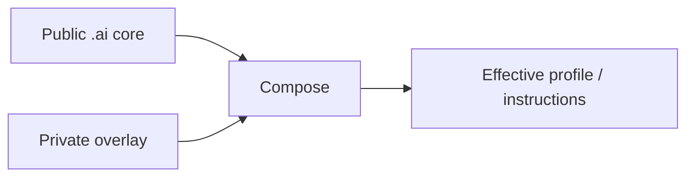

<div align="center">

# `.ai`

**Portable AI core for profiles, overlays, provider adapters, reusable instructions and skills.**

[](https://github.com/trvny/.ai/actions/workflows/validate.yml)
[](https://spdx.org/licenses/ISC)
<a href="https://deepwiki.com/trvny/.ai"></a>

[**Submodule guide**](docs/submodule.md) · [**Example overlay**](examples/profile.overlay.yaml) · [**Schema**](schema/style-profile.schema.json)

</div>

---

## Public core, private overlay

`.ai` keeps reusable AI configuration in one public place while downstream repositories keep their own private or project-specific differences.


```mermaid
flowchart LR
    C[Public .ai core] --> M[Compose]
    O[Private overlay] --> M
    M --> E[Effective profile / instructions]
```

Later layers win. Reusable changes go upstream; local differences stay downstream. No reverse synchronization is needed.

## Layout

```text
.ai/
├── AGENTS.md      canonical repository guidance
├── CLAUDE.md      symlink -> AGENTS.md
├── GEMINI.md      symlink -> AGENTS.md
├── profiles/      base profiles
├── examples/      overlay examples
├── schema/        profile schema
├── tools/         composition helpers
├── tests/         core and repository contract tests
├── instructions/  reusable instructions
├── styles/        style guidance
├── templates/     project starters
├── skills/        portable opt-in skills
├── .claude/       Claude reference defaults
└── .codex/        Codex reference defaults
```

`CLAUDE.md` and `GEMINI.md` are symlinks to the canonical `AGENTS.md`, keeping one maintained source of repository guidance.

Files here are building blocks. Providers do not automatically discover or apply everything in the repository.

## Use it in another repository

The usual setup is a pinned submodule plus a local overlay:

```bash
git submodule add https://github.com/trvny/.ai.git .ai/core
cp .ai/core/examples/profile.overlay.yaml .ai/profile.yaml
```

For repositories that already use it:

```bash
git submodule update --init --recursive
```

See **[docs/submodule.md](docs/submodule.md)** for cloning, profile composition, rendering, updates and CI checkout.

## Composition

```bash
python .ai/core/tools/merge_profile.py \
  .ai/core/profiles/default.yaml \
  .ai/profile.yaml \
  --schema .ai/core/schema/style-profile.schema.json \
  --output .ai/generated/profile.yaml
```

The final composed profile is validated against the schema. Partial overlays only need to contain the values they change.

Provider-specific files remain reference defaults. Adapt or expose them where the consuming tool expects them rather than duplicating the whole core.

## Security boundary

Keep credentials, tokens, personal paths, private endpoints and machine-specific configuration out of the public core. Use environment variables, secret storage or ignored local files instead.

## Design rules

- one maintained source of truth per concern
- public core, downstream overlays
- thin provider adapters
- generated output separate from maintained input
- simple files before frameworks
- explicit behavior before hidden magic

## License

[ISC](LICENSE)

---

## 📰 Mininews

<!--README_FEED:START-->
- [Can Nuclear Fuel be Delivered in Time to Power Advanced Nuclear Reactors?](https://carnegieendowment.org/research/2026/10/can-nuclear-fuel-be-delivered-in-time-to-power-advanced-nuclear-reactors)
- [Policjantka z Chrzanowa najlepszym oskarżycielem publicznym - Przelom.pl - portal ziemi chrzanowskiej](https://news.google.com/atom/articles/CBMiqgFBVV95cUxNbGVjQnBfMzFfUmppWlZrWkpWUk9RbG1HM0wwdm9qak0wOVc0YUVCRm1tSF9mREYwNDVwZ1JKcU1NT1d6cUdwNkE0T18wLVVxWGJqbDRtSlRCSFgzeXJCeG9BNDM0R1JKSHNQRUhuV2E4T0x1VktwNHlrZkIwdFNKc0dkbnlaZUdkclZENGxWd080OW9CdTQyY2RqcS0zMF9kNUU1eDJ1NWdwQQ?oc=5)
- [Christa Pike 'angry and confused' about Tennessee's failed execution effort, lawyers say](https://www.reuters.com/legal/government/christa-pikes-lawyers-demand-see-syringes-drug-residue-botched-execution-2026-10-07/)
- [FBI arrests man for plotting mass shooting at Mall of America](https://www.reuters.com/legal/government/fbi-arrests-man-plotting-mass-shooting-mall-america-2026-10-07/)
- [Venezuela's Maduro to face new US charges over alleged torture of Americans, official says](https://www.reuters.com/world/americas/maduro-wife-expected-face-new-charges-over-alleged-torture-americans-cnn-says-2026-10-07/)
- [Spanish woman whose eviction ignited housing protests dies at 87](https://www.reuters.com/world/evicted-spanish-octogenarian-maricarmen-abascal-heart-spains-housing-protests-2026-10-07/)
<!--README_FEED:END-->

## 💬 Cytat z szuflady

<!-- markdownlint-disable MD033 -->
<!--STARTS_HERE_QUOTE_README-->
<i>❝In Windows 98, minimized windows are actually moved far away outside the average monitor’s resolution.❞</i>
<!--ENDS_HERE_QUOTE_README-->
<!-- markdownlint-enable MD033 -->
