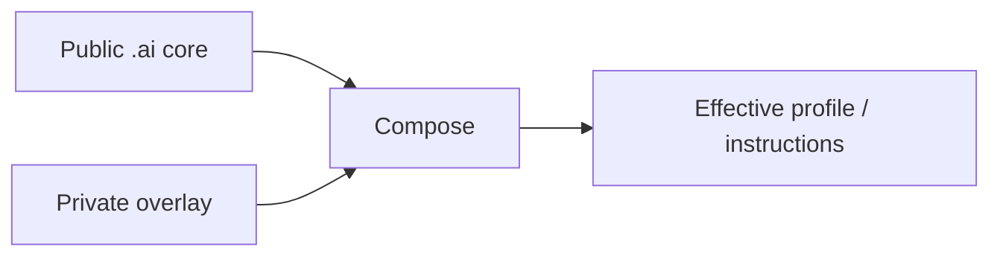

<div align="center">

# `.ai`

**Portable AI core for profiles, overlays, provider adapters, reusable instructions and skills.**

[](https://github.com/trvny/.ai/actions/workflows/validate.yml)
[](https://spdx.org/licenses/ISC)
<a href="https://deepwiki.com/trvny/.ai"></a>

[**Submodule guide**](docs/submodule.md) · [**Example overlay**](examples/profile.overlay.yaml) · [**Schema**](schema/style-profile.schema.json)

</div>

---

## Public core, private overlay

`.ai` keeps reusable AI configuration in one public place while downstream repositories keep their own private or project-specific differences.


```mermaid
flowchart LR
    C[Public .ai core] --> M[Compose]
    O[Private overlay] --> M
    M --> E[Effective profile / instructions]
```

Later layers win. Reusable changes go upstream; local differences stay downstream. No reverse synchronization is needed.

## Layout

```text
.ai/
├── AGENTS.md      canonical repository guidance
├── CLAUDE.md      Claude import shim -> AGENTS.md
├── GEMINI.md      Gemini import shim -> AGENTS.md
├── profiles/      base profiles
├── examples/      overlay examples
├── schema/        profile schema
├── tools/         composition helpers
├── tests/         core and repository contract tests
├── instructions/  reusable instructions
├── styles/        style guidance
├── templates/     project starters
├── skills/        portable opt-in skills
├── .claude/       Claude reference defaults
└── .codex/        Codex reference defaults
```

`CLAUDE.md` and `GEMINI.md` are regular text import shims rather than symlinks, so the canonical `AGENTS.md` also works in Windows checkouts without requiring symlink support.

Files here are building blocks. Providers do not automatically discover or apply everything in the repository.

## Use it in another repository

The usual setup is a pinned submodule plus a local overlay:

```bash
git submodule add https://github.com/trvny/.ai.git .ai/core
cp .ai/core/examples/profile.overlay.yaml .ai/profile.yaml
```

For repositories that already use it:

```bash
git submodule update --init --recursive
```

See **[docs/submodule.md](docs/submodule.md)** for cloning, profile composition, rendering, updates and CI checkout.

## Composition

```bash
python .ai/core/tools/merge_profile.py \
  .ai/core/profiles/default.yaml \
  .ai/profile.yaml \
  --schema .ai/core/schema/style-profile.schema.json \
  --output .ai/generated/profile.yaml
```

The final composed profile is validated against the schema. Partial overlays only need to contain the values they change.

Provider-specific files remain reference defaults. Adapt or expose them where the consuming tool expects them rather than duplicating the whole core.

## Security boundary

Keep credentials, tokens, personal paths, private endpoints and machine-specific configuration out of the public core. Use environment variables, secret storage or ignored local files instead.

## Design rules

- one maintained source of truth per concern
- public core, downstream overlays
- thin provider adapters
- generated output separate from maintained input
- simple files before frameworks
- explicit behavior before hidden magic

## License

[ISC](LICENSE)

---

## 📰 Mininews

<!--README_FEED:START-->
- [I LO w Chrzanowie świętuje jubileusz z absolwentami - Przelom.pl - portal ziemi chrzanowskiej](https://news.google.com/atom/articles/CBMi2wFBVV95cUxPS0xvVlI2STRvZTZ1b0l2SnJjQTJ5aEM0V29ZWVNPMkRlQVRpNEh3TkVfdlJqaTJRNExsWEQxd0QtSmpwc2tlVDlSY0pWOU51Tm05WXI2YUE4Si11TERaYWE5TjZfZmY2UFZrSFZxbmJfLWY0RDVlX0l4R3NBNmdOUVpMNHZtSWVaNXhUQW5rd2lMVG5MWnB5UkQ0RzNwaHVmeEV0U1NUMmE1aUhNa3EyaVc5TF84dUJxNXlUQW1xV2NFRW56SUFYZTlzUWZ1XzRyWlk4ZGdCVHA2UVk?oc=5)
- [Mieszkańcy nie kryją strachu. Setki ich działek trafią do polderów - Przelom.pl - portal ziemi chrzanowskiej](https://news.google.com/atom/articles/CBMiuwFBVV95cUxOZHlZb0FrczllSkhvOXVuLUJOX1VMQVMxTnhnMVpZVlFXQVg4bXlSbm9tNHczdGtTZzhHb0d5OHFnZG9nNk13T3RTLXZNUVRaQlNhZjRUeHZUdmI2Z2k3dmpnWEpyOEdGWVJhbklNaGNRVldYZlZDQTdCT0l3bUUxWXhibnAyLW9SWTRvMUs5OFFnYnFpNDlPTkdNcGppRGt2bDdvaXZGY21QeUMtN01WUTl5WWNTVXRnVDZF?oc=5)
- [Fed's Williams sees no urgency for next Fed rate hike](https://www.reuters.com/business/feds-williams-sees-no-urgency-next-fed-rate-hike-2026-09-29/)
- [OpenAI’s latest features take direct aim at the app store model](https://techcrunch.com/2026/09/29/openais-latest-features-take-direct-aim-at-the-app-store-model/)
- [Supreme Court lets Trump resume deporting migrants to countries not their own](https://www.reuters.com/world/supreme-court-lets-trump-resume-third-country-deportations-2026-09-29/)
- [Somali pirates kill 5 crew members before tanker rescue, state authorities say](https://www.reuters.com/world/africa/puntland-forces-rescue-another-hijacked-ship-somali-pirates-2026-09-29/)
<!--README_FEED:END-->

## 💬 Cytat z szuflady

<!-- markdownlint-disable MD033 -->
<!--STARTS_HERE_QUOTE_README-->
<i>❝It does good also to take walks out of doors, that our spirits may be raised and refreshed by the open air and fresh breeze: sometimes we gain strength by driving in a carriage, by travel, by change of air, or by social meals and a more generous allowance of wine. — Seneca❞</i>
<!--ENDS_HERE_QUOTE_README-->
<!-- markdownlint-enable MD033 -->
