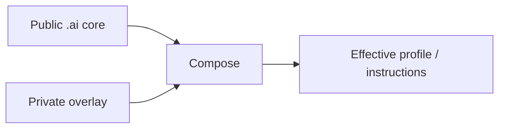

<div align="center">

# `.ai`

**Portable AI core for profiles, overlays, provider adapters, reusable instructions and skills.**

[](https://github.com/trvny/.ai/actions/workflows/validate.yml)
[](https://spdx.org/licenses/ISC)
<a href="https://deepwiki.com/trvny/.ai"></a>

[**Submodule guide**](docs/submodule.md) · [**Example overlay**](examples/profile.overlay.yaml) · [**Schema**](schema/style-profile.schema.json)

</div>

---

## Public core, private overlay

`.ai` keeps reusable AI configuration in one public place while downstream repositories keep their own private or project-specific differences.


```mermaid
flowchart LR
    C[Public .ai core] --> M[Compose]
    O[Private overlay] --> M
    M --> E[Effective profile / instructions]
```

Later layers win. Reusable changes go upstream; local differences stay downstream. No reverse synchronization is needed.

## Layout

```text
.ai/
├── AGENTS.md      canonical repository guidance
├── CLAUDE.md      Claude import shim -> AGENTS.md
├── GEMINI.md      Gemini import shim -> AGENTS.md
├── profiles/      base profiles
├── examples/      overlay examples
├── schema/        profile schema
├── tools/         composition helpers
├── tests/         core and repository contract tests
├── instructions/  reusable instructions
├── styles/        style guidance
├── templates/     project starters
├── skills/        portable opt-in skills
├── .claude/       Claude reference defaults
└── .codex/        Codex reference defaults
```

`CLAUDE.md` and `GEMINI.md` are regular text import shims rather than symlinks, so the canonical `AGENTS.md` also works in Windows checkouts without requiring symlink support.

Files here are building blocks. Providers do not automatically discover or apply everything in the repository.

## Use it in another repository

The usual setup is a pinned submodule plus a local overlay:

```bash
git submodule add https://github.com/trvny/.ai.git .ai/core
cp .ai/core/examples/profile.overlay.yaml .ai/profile.yaml
```

For repositories that already use it:

```bash
git submodule update --init --recursive
```

See **[docs/submodule.md](docs/submodule.md)** for cloning, profile composition, rendering, updates and CI checkout.

## Composition

```bash
python .ai/core/tools/merge_profile.py \
  .ai/core/profiles/default.yaml \
  .ai/profile.yaml \
  --schema .ai/core/schema/style-profile.schema.json \
  --output .ai/generated/profile.yaml
```

The final composed profile is validated against the schema. Partial overlays only need to contain the values they change.

Provider-specific files remain reference defaults. Adapt or expose them where the consuming tool expects them rather than duplicating the whole core.

## Security boundary

Keep credentials, tokens, personal paths, private endpoints and machine-specific configuration out of the public core. Use environment variables, secret storage or ignored local files instead.

## Design rules

- one maintained source of truth per concern
- public core, downstream overlays
- thin provider adapters
- generated output separate from maintained input
- simple files before frameworks
- explicit behavior before hidden magic

## License

[ISC](LICENSE)

---

## 📰 Mininews

<!--README_FEED:START-->
- [The Debt Toll Booth: A Modular Solution to Addressing Sovereign Debt Crises](https://carnegieendowment.org/research/2026/10/the-debt-toll-booth-a-modular-solution-to-addressing-sovereign-debt-crises)
- [Wieś podzielona na pół. Tędy już nie przejedziemy - krzeszowiceone.pl](https://news.google.com/atom/articles/CBMinwFBVV95cUxNaHJ5TWZmSl92bFNxemU0RW50MnEwcHFuTUR3aTduc0Z1LTdPWTdwcFhpZGJ2X2FJNnBwZU9ndHBuUHEwYUhjRm53eVU3RklINnlGRFBQdjVBdjBZMTMtRU9MYWpaVkN4Q3lTTzVKMDV0NElzRXdzdHdLQUFYQUw2WHFRZjE1bWRMMUZha3NwWE5RXzhrQklLVVpzNE5mWjDSAaQBQVVfeXFMTmZ3cG1zd2h2Nk9fdWlFbDBtRzhjMkhRU3dQVUptYm1hbkRPVkV5N2lrMHJGLXpDUFR4VkkzZUtSM3dkNllNdjRLdHpzYzViaGs2REJ5Y1M1cTZYNnFNbmE2OGtpTVM2TTZ0MHR5M3k5alYtUXF2Q3B2QVlnblh2WTVCX1B2RklHbEU2LVNHYWo1c0FWRXpQemREckhqTlFqVXVLSGk?oc=5)
- [Ostatnia stacja Drogi Żelaznej Warszawsko-Wiedeńskiej. Oto dworzec Sosnowiec Maczki w czasach swojej świetności - Dziennik Zachodni](https://news.google.com/atom/articles/CBMi6AFBVV95cUxOaXR4NDQ4U1U1M05paHd1TkhJUzJ1VV83VDZsbTF1cUh6dnV5aXBKREFZZXljb1hhOTFCSkpJcktlX0Ffa2ptOFk1ZHlHN3V5cDhEVmtJNEdUYnQ1SUdOS3J3U0d4eWMwSkdlcThIZVVtZlI4eXV3LVpMdmZFMzVvMGJpQ1ZHdzNhbktadl9BcEFrcVVDMzFIR0dYc3Rxd3hkV09CR0hCa0N6ZHJJdU9FN0lZdzVQLWFZZ0pyOWE2VU4zWTlVelhUNnZuTi1aZ3VIcUVXMHAtWFhUUDFsU2E4OGh2YVpPU0h3?oc=5)
- [Przegląd AI: 3 października 2026](https://promptowy.com/przeglad-ai-2026-10-03/)
- [Zamknięcie dnia: Agenci wymknęli się spod kontroli - i mamy dowody](https://promptowy.com/zamkniecie-dnia-agenci-wymkneli-sie-spod-kontroli-i-mamy-dowody/)
- [Co oznacza zielone kółko na WhatsApp?](https://antyweb.pl/co-oznacza-zielone-kolko-na-whatsapp)
<!--README_FEED:END-->

## 💬 Cytat z szuflady

<!-- markdownlint-disable MD033 -->
<!--STARTS_HERE_QUOTE_README-->
<i>❝The first electronic computer ENIAC weighed more than 27 tons and took up 1800 square feet.❞</i>
<!--ENDS_HERE_QUOTE_README-->
<!-- markdownlint-enable MD033 -->
